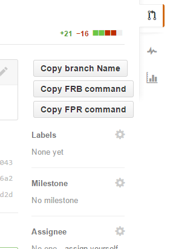

# Enhanced Github Chrome Extension

[@tomasfejfar](https://github.com/tomasfejfar/) has created following [Git aliases](https://git.wiki.kernel.org/index.php/Aliases#Introduction)
to allow easier Pull Requests review. And because copying the branch name from the PR is tricky, I created 
a [Google Chrome extension](https://chrome.google.com/webstore/detail/enhanced-github/ajdnkfdmjijmemfjogiabpoeihamlbgo) that adds fancy buttons to the PR page. (And I have some stuff planned for the future.)

### Fetch PR:
In case you just need to test the PR locally, add this alias:

`fpr = "!f() { git stash; git fetch upstream pull/$1/head:review/$1; git checkout review/$1; git stash pop; }; f"`

And use it like this: `git fpr [pr-number]`

### Fetch Remote Branch
In case you want to fetch someone's branch and work on it, add this alias:

`frb = "!f() { git stash; git fetch $1 $2:refs/remotes/$1/$2; git branch $1-$2 $1/$2 --track; git checkout $1-$2; git stash pop; }; f"`

And use it like this: `git frb [remote] [branch-name]`

## Versions

### 1.0.1 (2014-12-16)
- fixed issue when buttons were multiplicated when switching tabs back and forth

### 1.0.0 (2014-12-12)
- initial release

## License
MIT
